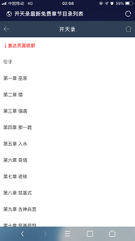

# 小说精品屋

#### 背景介绍
小说精品屋是一个功能完善的小说弹幕网站，包含精品小说专区和轻小说专区。包括小说分类、小说搜索、小说排行、完本小说、小说评分、小说在线阅读、小说书架、阅读记录、小说下载、小说弹幕、小说自动爬取、小说内容自动分享到微博、邮件自动推广、链接自动推送到百度搜索引擎等功能。包含电脑端、移动端、微信小程序等多个平台，现已开源web端和微信小程序端源码，大家可以用于学习或者商用。

该项目来源于个人真实运营项目，因为没去做SEO，所以用户注册量不大，但是依然有一批用户一直都在支持着，自己也没去接入广告赚钱，因为这样网站的体验就差了。自己已经没有太大精力运营下去了，所以就把源码开源一下，把机会留给有兴趣搞小说网站的朋友们。只要你的硬盘足够大，爬虫程序理论上是可以无限制地爬取网络小说的，大家可以根据自己的需求去修改，有什么问题或者好的有趣的需求也可以和我提，有时间我还是会继续维护这份源码的。大家可以根据自己是想真实运营还是学习的需求去使用爬虫程序吧，如果只是想演示一下的话，运行爬虫程序几分钟数据就足够了 。

#### 软件架构
Springboot+Mybatis+Mysql+Ehcache+Thymeleaf+Layui

#### 安装教程

1. 数据准备，拉取小说爬虫程序，按照说明文件爬取网络小说到数据库中。（[点击获取爬虫程序](https://gitee.com/xiongxyang/crawl-book)）
2. 修改项目application.yml配置文件中的数据库配置。
3. 本地直接运行或使用maven插件打包成jar文件上传到服务器上。
4. `http://ip:port`访问首页
5. `http://ip:port/books`访问精品小说模块
6. `http://ip:port/book/searchSoftBook.html`访问轻小说模块

#### 项目截图

1. 电脑端（首页）

   

2. 移动端（首页）

   

3. 移动端（轻小说专区）

   

4. 移动端（小说详情页）

   

   

5. 移动端（目录页）

   

6. 移动端（小说阅读页）

   

7. 小程序

##### 演示地址1

[点击前往](https://www.zinglizingli.xyz)

##### 演示地址2（备用）

[点击前往](http://47.106.243.172)

#### 小程序二维码

#### QQ交流群

#### PS

本人提倡共享精神，该项目可自由用于任何场景，做任何修改，但是修改后的项目建议开源，否则需要经过作者同意才能用于商用，谢谢！个人精力有限，欢迎大家加入项目开发者中共同完善项目。

