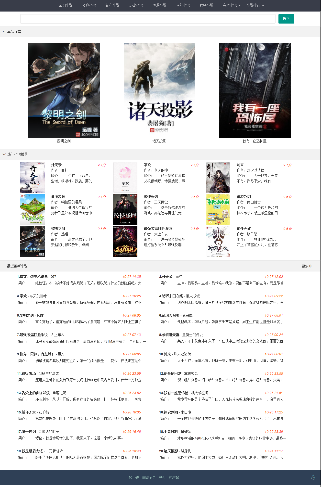
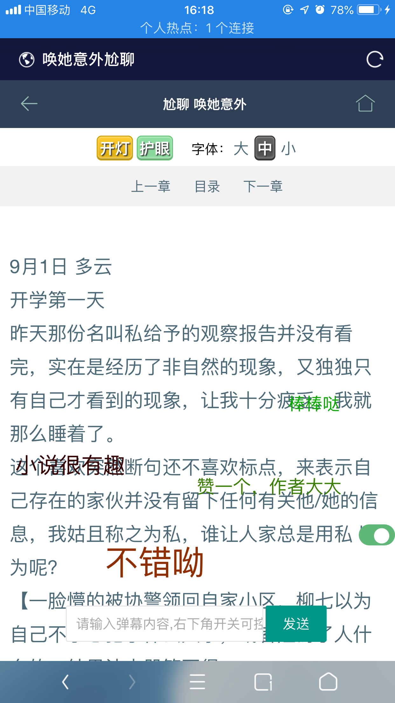

# 小说精品屋

#### 介绍
小说精品屋是一个功能完善的小说弹幕网站，包含精品小说专区和轻小说专区。包括小说分类、小说搜索、小说排行、小说评分、小说在线阅读、小说书架、小说下载、小说弹幕、小说自动爬取、小说内容自动分享到微博、链接自动推送到百度搜索引擎等功能。现公布web端代码，需要android端和小程序代码的也可以找我。

#### 软件架构
Springboot+Mybatis+Mysql+Ehcache+Thymeleaf+Layui

#### 安装教程

1. 数据准备，拉取小说爬虫程序，按照说明文件爬取网络小说到数据库中。（[点击获取爬虫程序](https://gitee.com/xiongxyang/crawl-book)）
2. 修改项目application.yml配置文件中的数据库配置。
3. 本地直接运行或使用maven插件打包成jar文件上传到服务器上。
4. http://ip:port访问首页
5. http://ip:port/books访问精品小说模块
6. http://ip.port/book/searchSoftBook.html访问轻小说模块

#### 项目截图

1. 电脑端（首页）

   

2. 移动端（首页）

   

3. 移动端（轻小说专区）

   

4. 移动端（小说详情页）

   

   

5. 移动端（小说阅读页）

   

6. 小程序

##### 演示地址1

[点击前往](https://www.zinglizingli.xyz)

##### 演示地址2（备用）

[点击前往](http://47.106.243.172)

#### 小程序二维码

