# 小说精品屋

#### 项目介绍
小说精品屋是一个多平台（web、安卓app、微信小程序）、功能完善的小说弹幕网站，包含精品小说专区、轻小说专区和漫画专区。包括小说/漫画分类、小说/漫画搜索、小说/漫画排行、完本小说/漫画、小说/漫画评分、小说/漫画在线阅读、小说/漫画书架、小说/漫画阅读记录、小说下载、小说弹幕、小说/漫画自动爬取、小说内容自动分享到微博、邮件自动推广、链接自动推送到百度搜索引擎等功能。包含电脑端、移动端、微信小程序等多个平台，现已开源web端、安卓端、小程序端源码。 

#### 目录结构

novel-front ： 前台web网站源码（独立项目，按需安装） 

novel-admin ：平台后台管理系统源码（独立项目，按需安装） 

#### 软件架构
前台web网站架构：Springboot+Mybatis+Mysql+Ehcache+Thymeleaf+Layui

平台后台管理系统架构 : Springboot+Mybatis+Mysql+Redis+Thymeleaf+Layui+Bootstrap

#### 前台web网站截图

1. 电脑端（首页）

   

2. 移动端（首页）

   

3. 移动端（轻小说专区）

   

4. 移动端（动漫专区）

   

5. 移动端（小说详情页）

   

   

6. 移动端（目录页）

   

7. 移动端（小说阅读页）

   

   8.电脑端（漫画阅读页）

   

   

#### 后台管理系统截图

1. 登录界面

   

2. 爬虫管理界面

   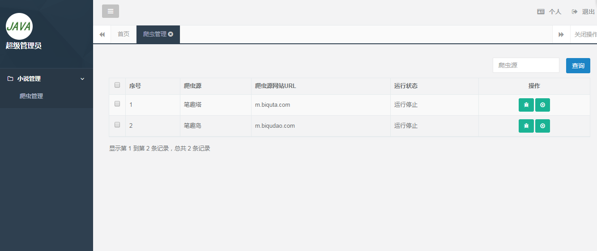

   3.爬虫配置界面。

   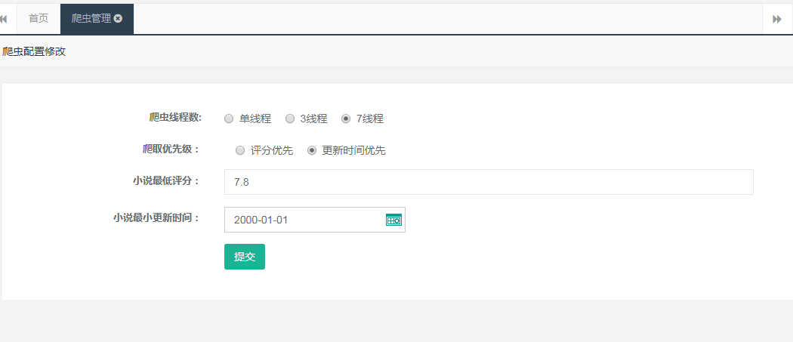

   3.小说管理页面。

   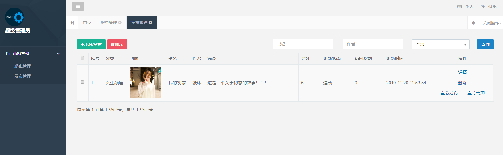
   
   4.小说发布页面。
   
   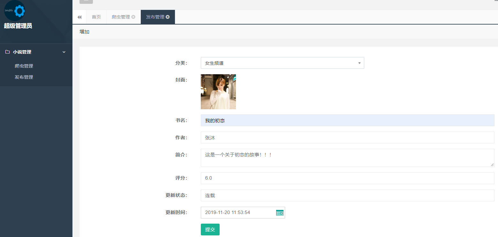
   
   5.小说章节发布页面
   
   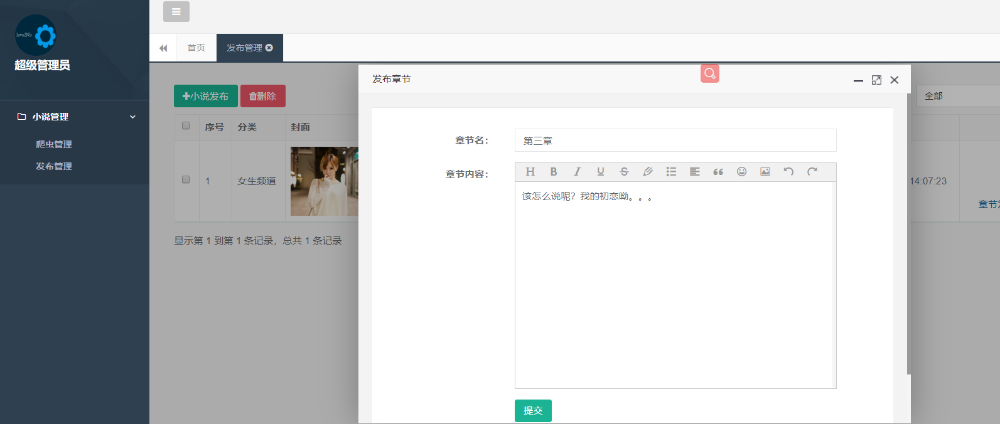
   
   6.小说章节管理页面。
   
   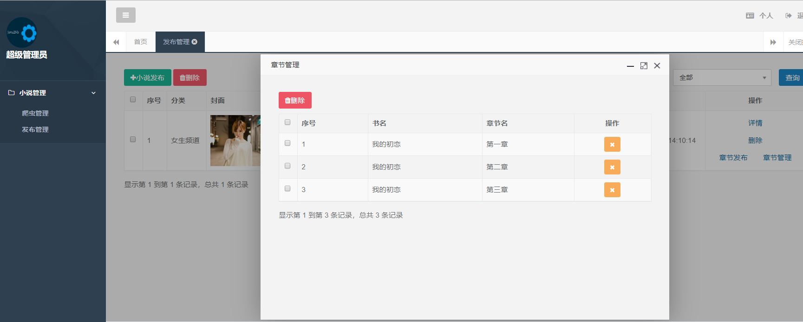

#### 微信小程序截图

#### 安卓App截图

#### 安装教程

数据库安装：

1. 安装MySQL软件。
2. 新建数据库books:create database books default character set utf8mb4 collate utf8mb4_general_ci 。
3. 执行sql/books.sql文件。

小说数据爬取的两种方式 ：

1. 拉取小说爬虫程序，按照说明文档爬取网络小说到数据库中。（[点击获取爬虫程序](https://gitee.com/xiongxyang/crawl-book)）（适用于本地多机器运行） 
2. 安装后台管理系统后，打开爬虫管理菜单，点击爬虫运行按钮。（适用于线上环境运行，会占用较多服务器资源）

平台后台管理系统安装（独立项目，按需安装） ：

1. 修改application.yml文件中数据库配置。

2. 修改application.yml文件中Redis配置。

3. 修改application.yml文件中文件上传路径配置。

   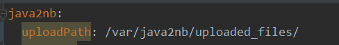

4. 启动程序，登录后台系统，运行爬虫程序爬取小说数据。

   

前台web网站安装（独立项目，按需安装） ：

1. 修改项目application.yml配置文件中的数据库配置。

   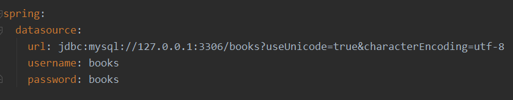

2. 修改项目application.yml配置文件中的首页本站推荐小说配置（修改的小说需要在数据库中存在）。

   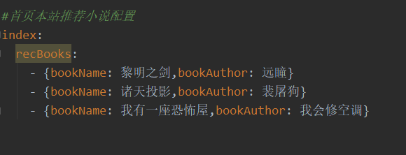

3. 根据需求，修改项目application.yml配置文件中的爬取小说最低评分配置（建议和爬虫程序中的最低评分配置保持一致）。

   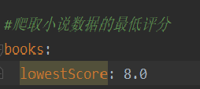

4. 根据需求，修改项目application.yml配置文件中的小说爬虫源配置。

   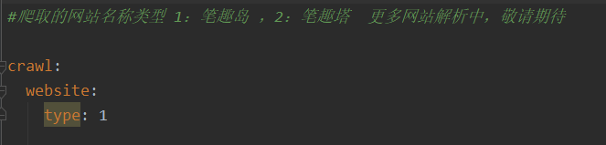

5. 根据需求，修改项目application.yml配置文件中的图片保存方式。

   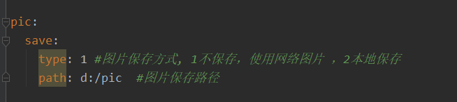

6. 本地直接运行或使用maven插件打包成jar文件上传到服务器上。

7. `http://ip:port`访问首页。

8. `http://ip:port/books`访问精品小说模块。

9. `http://ip:port/book/searchSoftBook.html`访问轻小说模块。

10. `http://ip:port/book/searchMhBook.html`访问漫画模块。

**喜欢此项目的可以给我的GitHub和Gitee加个Star支持一下 。**

##### 演示地址1

[点击前往](http://148.70.59.92:8080)（前台，域名已过期，11月30日服务器过期 ）（未上线漫画专区功能）

**演示地址2**

[点击前往](https://book.100boot.cn/)（前台，推荐）（未上线漫画专区功能）

**演示地址3**

[点击前往](http://www.jsy66.vip/)（未上线漫画专区功能）

##### 演示地址4（备用）

[点击前往](http://47.106.243.172:8888)（前台）（已上线漫画专区）

[点击前往 ](http://47.106.243.172:8888) （后台）   (**后台爬虫程序运行会占用大量服务器资源，试用人数过多，服务器压力大，现暂停演示** )

演示账号：admin/admin123

#### 小程序二维码

#### 代码仓库

 Gitee仓库地址：  https://gitee.com/xiongxyang/fiction_house 

 GitHub仓库地址：  https://github.com/201206030/fiction_house 

#### 文档地址

 http://www.java2nb.com/article/5.html 

#### QQ交流群

#### 捐赠支持

开源项目不易，若此项目能得到你的青睐，可以捐赠支持作者持续开发与维护。 

##### 捐赠名单 

| 捐赠者 | 金额     | 时间                        |
| :----- | :------- | :-------------------------- |
| *勇    | ￥20.00  | 2019年11月30日 下午16点13分 |
| *伟    | ￥10.00  | 2019年11月14日 上午11点02分 |
| *式    | ￥8.88   | 2019年11月12日 下午23点54分 |
| *星    | ￥20.00  | 2019年11月12日 下午20点11分 |
| *😊     | ￥100.00 | 2019年11月12日 下午15点32分 |
| *东    | ￥10.00  | 2019年11月11日 下午21点23分 |
| *海    | ￥15.00  | 2019年11月11日 上午7点45分  |
| *飞    | ￥5.00   | 2019年11月11日 上午0点14分  |
| *沐    | ￥10.00  | 2019年11月10日 上午12点09分 |

#### 备注

精品小说屋所有相关项目均已在开源中国公开，感兴趣的可进入[开源中国](https://www.oschina.net/p/fiction_house)按关键字`精品小说屋`搜索。